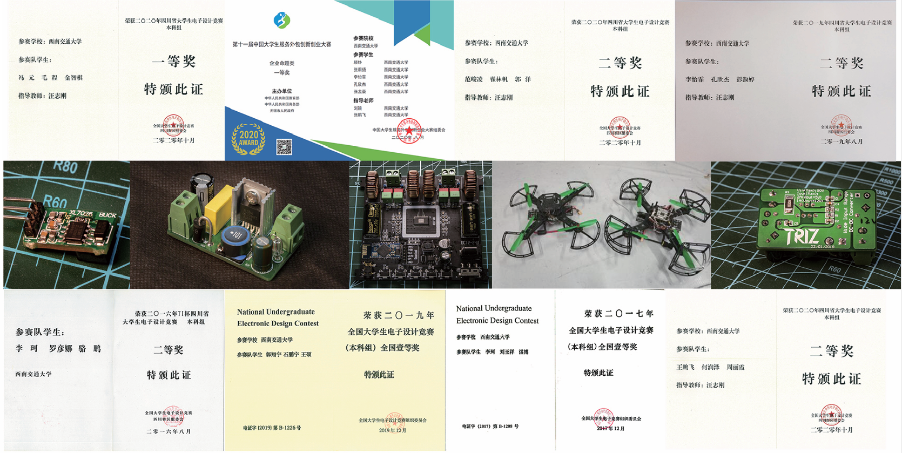
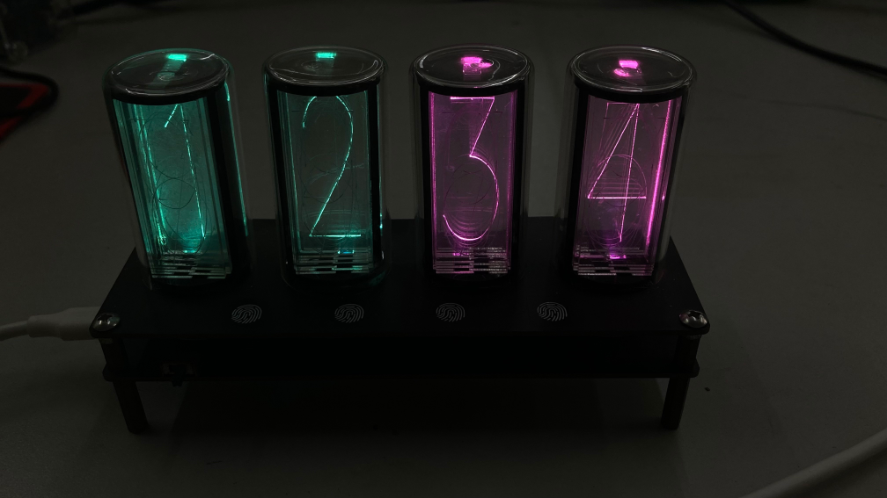
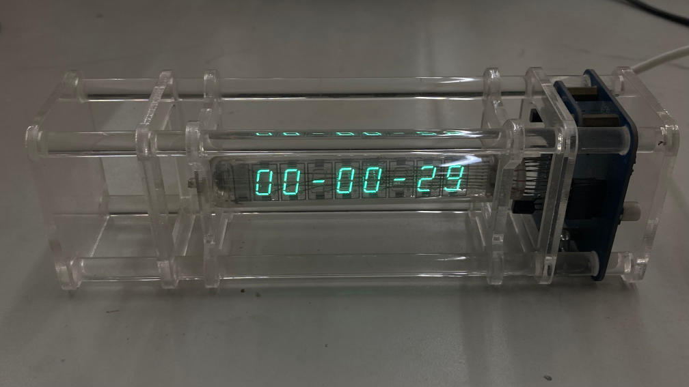
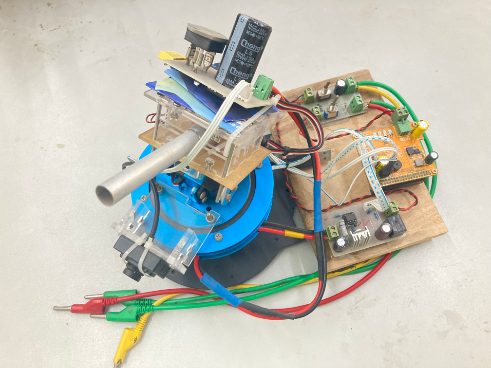
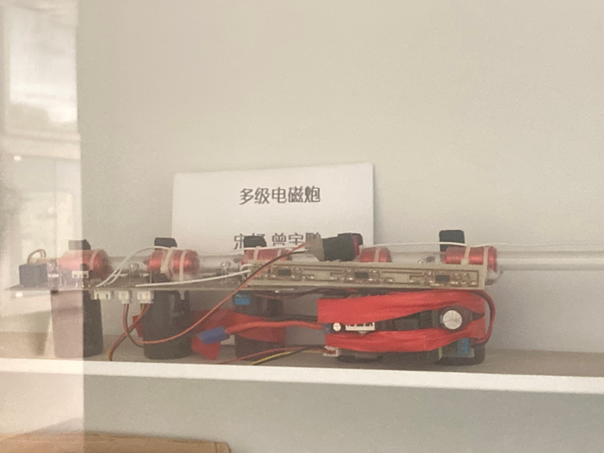

# **我们的成果 🏆**

## 📖 发展历程

自2014年成立以来始终将主要推进方向放在一年一度的大学生电子设计竞赛和大学生科创训练计划(SRTP)上，截止至2024年已取得了数十项**全国大学生电子设计竞赛**的**国家级**奖项与**省级**奖项以及多个国家级SRTP项目与省级SRTP项目以“优”结题。

----

从2019年开始，实验室逐步开始**拓展推进方向**，也开始向其他大学生科创比赛进行拓展，例如：“挑战杯”全国大学生课外学术科技作品竞赛、全国大学生服务外 包创新创业大赛、大学生机械设计创新大赛等等。    

---

实验室始终关注各个成员的**综合发展**， 包括但不限于领导能力、学习能力、科学素养。

多年的发展和培养中实验室中涌现出许多优秀的同学，例如：2014级微电子专业专业前三名， 2016级、2017级、2019级、2020级、2021级微电子专业第一，2017级自动化、光电子等专业的前5%； 2019-2020学年、2020-2021学年、2022-2023学年“竢实扬华奖章”获得者;每学年的国家奖学金、国家励志奖学金获得者等等。并且实验室大部分成员均能以出色的成绩推免至心仪的高校攻读硕士研究生或博士研究生学位。

    

## 🎓 优秀的大家庭 

实验室历年来多人参加各类竞赛获得 **国家级奖项**，并且多人 **免研至知名高校**，包括：
- **中国科学院大学**
- **浙江大学**
- **哈尔滨工业大学**
- **北京航空航天大学**
- **东南大学**
- **北京理工大学**
- **电子科技大学**
- ......

::: tip 期待你的到来
优秀的成果是实验室团队努力的体现，也是我们未来不断追求卓越的动力！✨
:::

## 📚 往届学长学姐成果

    
    &emsp;
    
    &emsp;
    
    &emsp;
    
    &emsp;
    

::: danger 期待你的到来
未来，我们将继续努力，明天的TRIZ实验室将会更加美好！🎉
:::
