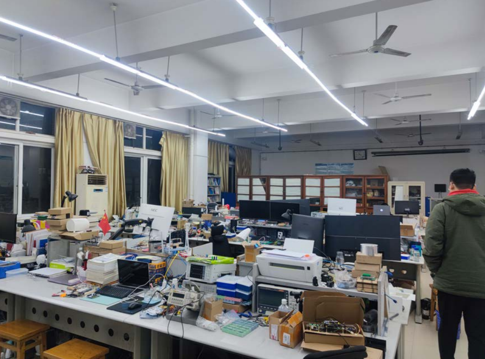
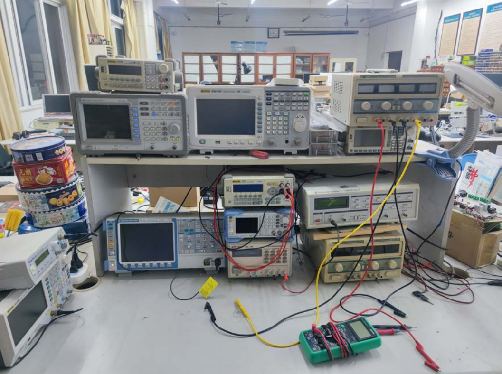
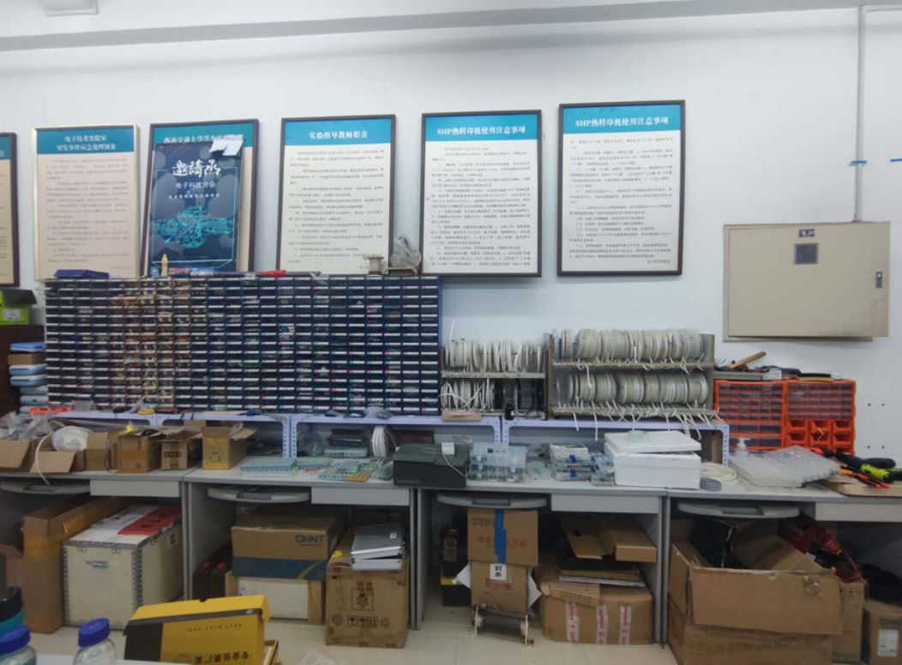
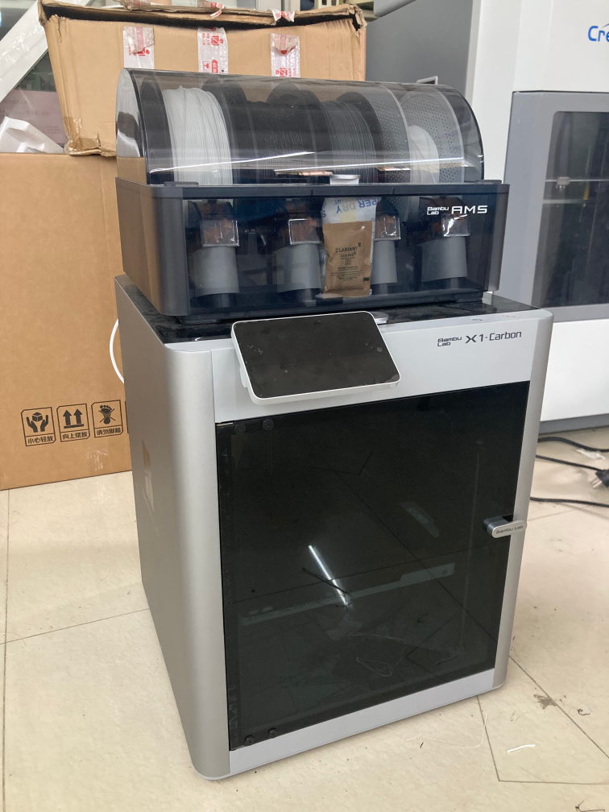
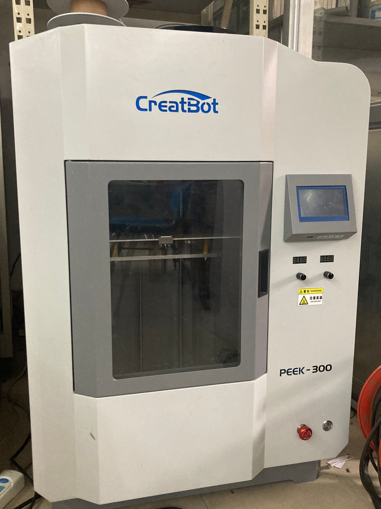
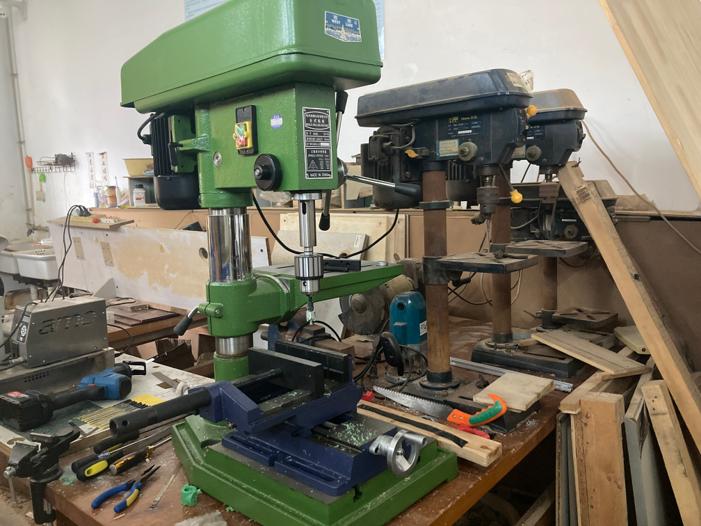
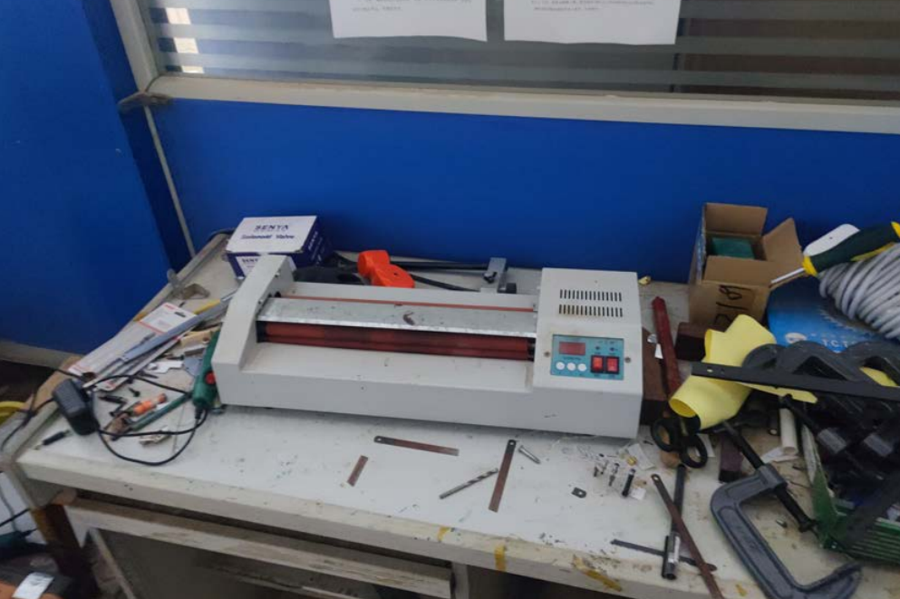
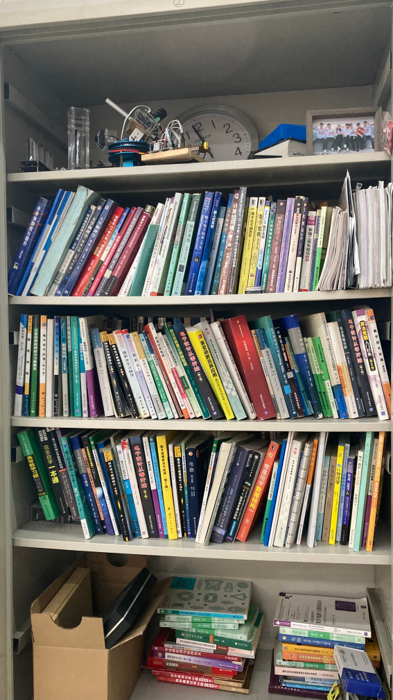
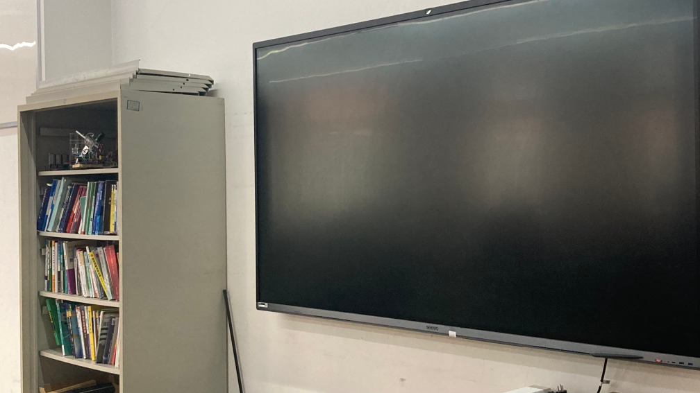

# TRIZ 介绍 ✏

## 📃 实验室介绍

**TRIZ** 实验室自2014年成立以来，一直致力于**全国大学生电子设计大赛、SRTP、横向项目** 等方面的研究与探索。实验室以**汪志刚老师、龙文杰老师和史燕老师**组成的导师团队，各个年级有设计经验的学生组成的导生团队，实行“导师、导生、顾问”的管理架构。

| 目前人员组成 |               人数                |
| :----------: | :-------------------------------: |
|    2021级    |                11                 |
|    2022级    |                11                 |
|    2023级    |                 5                 |
|    2024级    | ***#You are welcome to join us*** |

## 🌍 实验室环境

## 🧐 实验室设施
实验室设施齐全，包含以下设备与资源：
- 3D 打印机
- 雕刻机
- 示波器
- 电源
- 功率分析仪
- PCB 制作机
- 丰富的电子元器件储备

::: warning 激发想象力
这些设备和元器件能够充分支撑大家在自己感兴趣的领域内进行探索与创新！🎇
:::

### 应有尽有的仪器仪表
---

### 各类电子元器件
---

### 多台3D 打印机
---

	
	&emsp;
	

### 钻床
---

### 热转印机
---

### 各类书籍
---

### 多媒体设备
---

